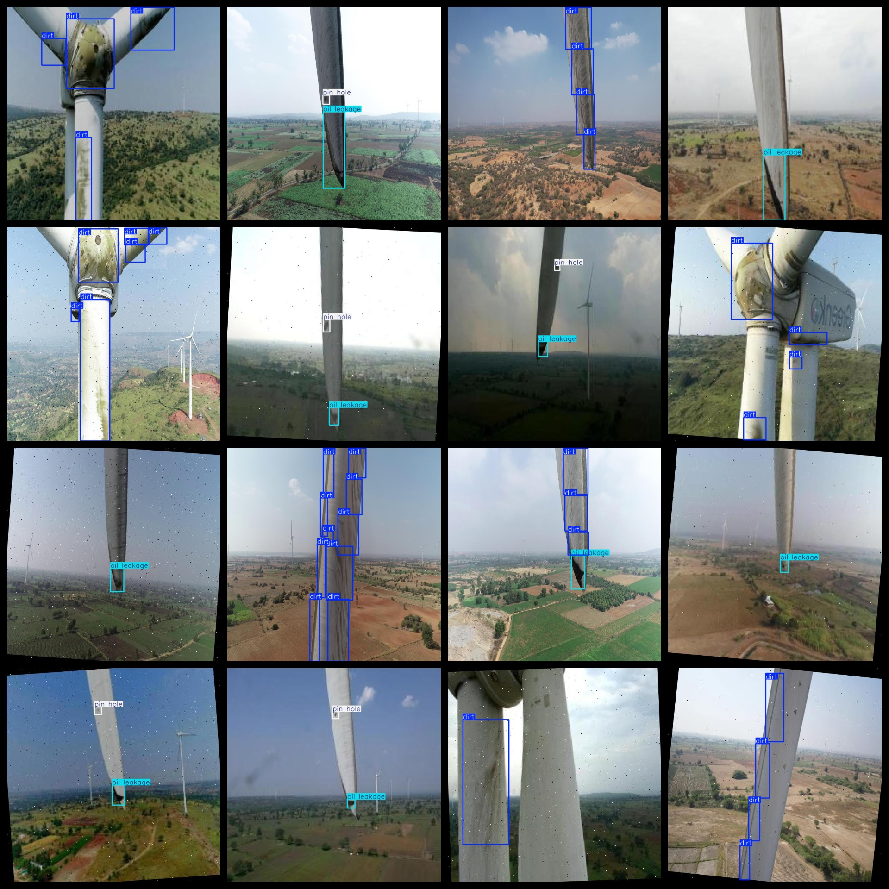

# Wind Vehicle Leaf Defect Dataset 4945 imagesVOC+YOLO format

The dataset of wind turbine blade defects includes 4945 images in VOC+YOLO format.

Dataset format: Pascal VOC format + YOLO format (the txt file does not contain the split path, it only contains jpg images and corresponding VOC format xml files and yolo format txt files)

Number of images (number of jpg files): 4945

Number of xml files: 4945

Number of TXT files: 4945

Number of annotated categories: 3

The Github repository is: datasets_sl

["dirt", "oil leakage", "pin hole"]

Labels: Dirty, Oil Leakage, Pinhole

Number of boxes labeled in each category:

Dirt Frames = 7956

Oil Leakage Frame Count = 2468

pin hole frame count = 1165

Total Frames: 11589

Number of images per category:

"Dirt" occupies 2760 pictures.

Oil Leakage occupies 2466 pictures.

Pinhole occupation of image = 1157

Image resolution: 640x640

Use the labeling tool: labelImg

Dataset Augmentation: Yes

Rules for annotation: Draw a rectangle around the category.

Important note: The dataset does not have been divided into training, validation, and testing sets.

Special Disclaimer: This dataset does not guarantee the accuracy of the trained models or weight files.

Annotation and image details are as follows:

## Images

---

Here is a pay link on Stripe (https://buy.stripe.com/3cs8yP7sY87d0vu9AB). Please contact me lonlonago@foxmail.com after funding $89, and I will send you a complete data files, thank you!

